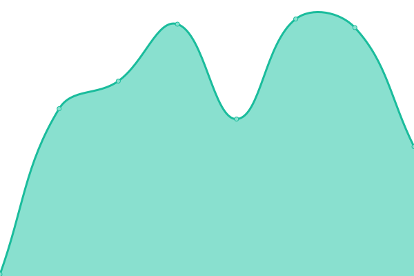

# [📈 Live Status](https://status.beltway.cloud): <!--live status--> **🟧 Partial outage**

This repository contains the open-source uptime monitor and status page for [Beltway Cloud](https://beltway.cloud), powered by [Upptime](https://github.com/upptime/upptime).

With [Upptime](https://upptime.js.org), you can get your own unlimited and free uptime monitor and status page, powered entirely by a GitHub repository. We use [Issues](https://github.com/BeltwayCloud/status/issues) as incident reports, [Actions](https://github.com/BeltwayCloud/status/actions) as uptime monitors, and [Pages](https://status.beltway.cloud) for the status page.

<!--start: status pages-->
<!-- This summary is generated by Upptime (https://github.com/upptime/upptime) -->
<!-- Do not edit this manually, your changes will be overwritten -->
<!-- prettier-ignore -->
| URL | Status | History | Response Time | Uptime |
| --- | ------ | ------- | ------------- | ------ |
|  [Home](https://beltway.cloud) | 🟥 Down | [home.yml](https://github.com/BeltwayCloud/status/commits/HEAD/history/home.yml) | 

 0ms
     
 | 

<a href="https://status.beltway.cloud/history/home">0.00%</a>
    

|  Portainer | 🟩 Up | [portainer.yml](https://github.com/BeltwayCloud/status/commits/HEAD/history/portainer.yml) | 

 226ms
     
 | 

<a href="https://status.beltway.cloud/history/portainer">99.90%</a>
    

|  [Apache Superset](https://superset.beltway.cloud) | 🟩 Up | [apache-superset.yml](https://github.com/BeltwayCloud/status/commits/HEAD/history/apache-superset.yml) | 

 448ms
     
 | 

<a href="https://status.beltway.cloud/history/apache-superset">100.00%</a>
    

|  [A11yWatch](https://a11ywatch.beltway.cloud) | 🟥 Down | [a11y-watch.yml](https://github.com/BeltwayCloud/status/commits/HEAD/history/a11y-watch.yml) | 

 0ms
     
 | 

<a href="https://status.beltway.cloud/history/a11y-watch">0.00%</a>
    

|  Tech Scan API | 🟩 Up | [tech-scan-api.yml](https://github.com/BeltwayCloud/status/commits/HEAD/history/tech-scan-api.yml) | 

 1084ms
     
 | 

<a href="https://status.beltway.cloud/history/tech-scan-api">99.90%</a>
    

|  [OctoPrint](https://print.beltway.buzz) | 🟥 Down | [octo-print.yml](https://github.com/BeltwayCloud/status/commits/HEAD/history/octo-print.yml) | 

 0ms
     
 | 

<a href="https://status.beltway.cloud/history/octo-print">0.00%</a>
    

<!--end: status pages-->

[**Visit our status website →**](https://status.beltway.cloud)

## 📄 License

- Powered by: [Upptime](https://github.com/upptime/upptime)
- Code: [MIT](./LICENSE) © [Beltway Cloud](https://beltway.cloud)
- Data in the `./history` directory: [Open Database License](https://opendatacommons.org/licenses/odbl/1-0/)
